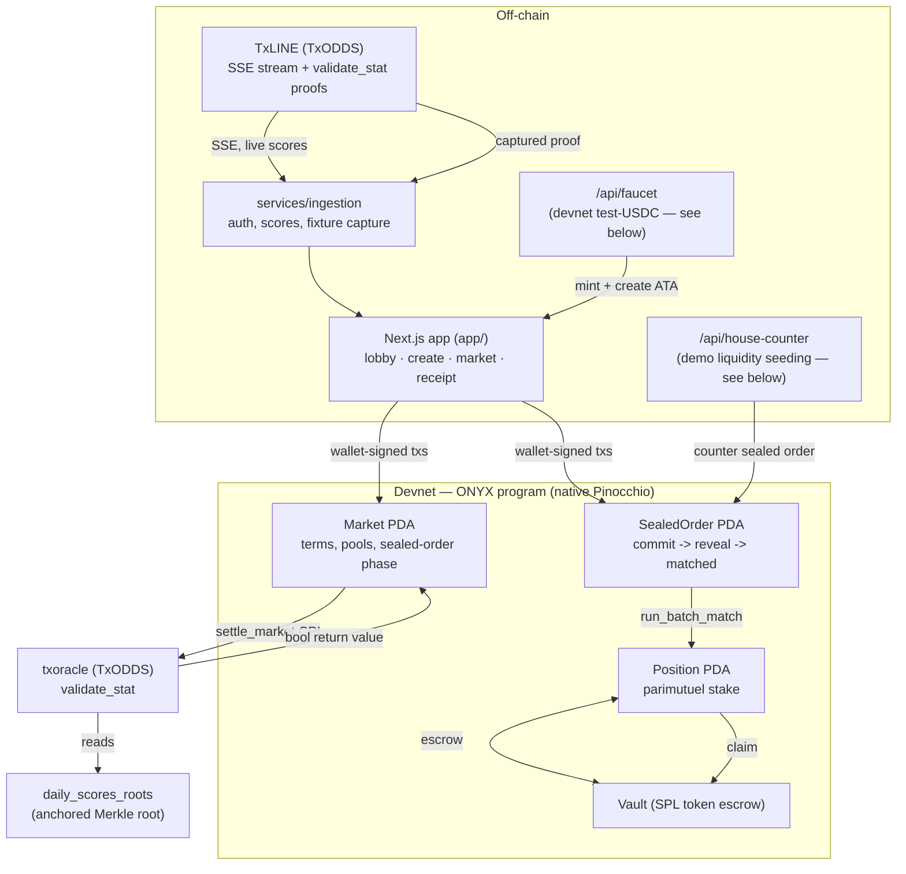
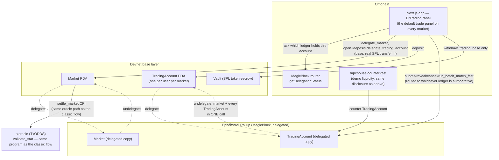
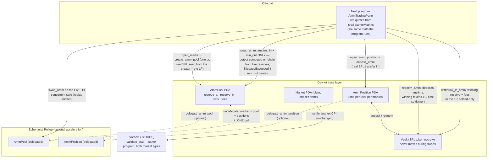

# ONYX

**Polymarket-style continuous trading on a MagicBlock Ephemeral Rollup,
with trustless settlement on Solana built directly on TxODDS's TxLINE.**

Two market types, one settlement truth. **AMM markets**: buy *and sell*
outcome tokens at any moment — the pool is the counterparty, seeded with
real capital, swaps confirm in ~1s on an Ephemeral Rollup with slippage
protection enforced on-chain. **Sealed-batch markets**: bets hidden until
a batch closes, then matched at a single uniform price with no
time-priority advantage — killing front-running and copy-trading without
adding any trust dependency. Either way, every market settles via a live
CPI into TxLINE's own `validate_stat` program — not an admin key, not an
off-chain resolver — and produces a receipt anyone can independently
verify against public RPC.

**One signature, then just trade.** Starting a trading session mints a
scoped MagicBlock session key (gpl_session) in the same transaction that
funds and delegates your position — after that every swap is **popup-free
and gas-free** on the ER (fees validator-sponsored; the session key holds
zero SOL and provably cannot withdraw funds — `bun run demo:session`).
Markets are created from TxLINE's **live fixture window** with real team
names, kickoff times, live scores/cards/corners, and bookmaker reference
odds beside the pool price.

Built for the [TxODDS World Cup Hackathon](https://superteam.fun/earn/listing/prediction-markets-and-settlement/)
— Prediction Markets & Settlement track. Native Pinocchio (`no_std`), no
Anchor. Devnet. This repository is the complete application: on-chain
program, Next.js frontend, and TxLINE data services.

| | |
|---|---|
| **Devnet program** | [`4LpMzq6wXYFMzxgbyMyN2ja4EQhPsYGHSCAvjwzA18MB`](https://explorer.solana.com/address/4LpMzq6wXYFMzxgbyMyN2ja4EQhPsYGHSCAvjwzA18MB?cluster=devnet) |
| **TxLINE oracle used** | `6pW64gN1s2uqjHkn1unFeEjAwJkPGHoppGvS715wyP2J` (txoracle, devnet) |
| **Run the app** | `cd app && bun install && bun run dev` |
| **Reproduce the sealed lifecycle in one command** | `bun run demo` (from the repo root) |
| **Reproduce the AMM lifecycle in one command** | `bun run demo:amm` (base layer) · `bun run demo:amm-er` (concurrent swaps on the ER + replay audit) |
| **Reproduce session trading in one command** | `bun run demo:session` (one-signature onboarding → popup-free gas-free ER swaps → revocation + funds-exit negatives, all live) |

---

## The six-part story

**1. Trustless settlement.** `settle_market` CPIs directly into TxLINE's
`validate_stat` and reads back a boolean. No admin discretion, no off-chain
resolver — same proof in, same payout out, every time. [Real tx →](#the-sealed-order-lifecycle-real-tx-signatures)

**2. An independently verifiable receipt.** Every settled market's outcome
is checkable by a stranger against public RPC alone: `validate_stat`'s own
return value, its on-chain log lines, and the `Market` account's
status/outcome all have to agree — with zero trust in ONYX's UI. See
`/receipt/:market` in the app.

**3. Parametric props, not just "who wins."** Markets are predicates over
TxLINE's per-fixture stat keys (`stat[key] {>,<,=} threshold`, optionally
combining two stats) — corners, cards, goals, whatever TxLINE tracks per
match — not just a binary final-score bet.

**4. Sell-anytime AMM markets — Polymarket-style continuous trading.**
The pool is the counterparty (Gnosis-style fixed-product market maker over
virtual complete-set outcome tokens), so anyone can buy **and sell** at any
moment before the close — no matching window, no waiting for the other
side. Liquidity is **real seeded capital** from the market's creator, who
becomes the LP and genuinely carries adverse-selection risk (observed live
in testing: both an LP gain and an LP loss). Every swap's output is
computed **on-chain from the reserves at execution time** — the client only
sends `amount_in` and `min_out`, and the user's slippage tolerance is
enforced by the program (`SlippageExceeded`, proven with a deliberate
on-chain revert), never advisory. The pool's solvency identity
(`vault == Σ deposits + sets_outstanding + fees`) held **to the lamport**
at every checkpoint of every live proof, and every proof run drained its
market vault to **exactly zero** after settlement.
[Real tx →](#the-amm-lifecycle-real-tx-signatures)

**5. Sub-second execution on a MagicBlock Ephemeral Rollup — both market
types.** AMM swaps run on the ER as pure account-data mutation (market +
pool + positions delegate together): ~1s confirmation, validator-sponsored
fees, and **concurrent swaps from independent wallets serialize correctly**
— proven by firing 4 genuinely concurrent swaps (`Promise.all`, 3-4 landing
in the *same ER slot*) and then replaying every slot-order-consistent
serialization through the same CPMM math: exactly **one** ordering
reproduces the final on-chain reserves and every wallet's position delta,
so no swap ever priced off stale reserves and no update was lost. Sealed
markets get the same ER speed for commit/reveal/match (`ErTradingPanel`,
3s batch cadence). Either way, state undelegates back to base for
settlement — the same oracle CPI in Part 1, untouched. Every read and
write is routed to whichever ledger currently holds that account's
authoritative state ([`src/lib/erRouting.ts`](app/src/lib/erRouting.ts)),
and wrong-ledger races surface as plain-language retry messages.
[Real tx →](#the-er-fast-lifecycle-real-tx-signatures)

**6. MEV honesty, by construction and by disclosure.** Sealed-batch
markets are MEV-proof: bets are 32-byte commitments until reveal, then one
deterministic uniform-price match — no order benefits from submission
order. AMM markets are **not** MEV-proof (no AMM is — ordering belongs to
the sequencer), and the UI says so in-panel rather than hiding it, pointing
at sealed markets as the MEV-proof alternative. On-chain `min_out` bounds
the damage of any adverse ordering; it doesn't eliminate it. Two market
types, honestly labeled trade-offs. [Real tx →](#the-sealed-order-lifecycle-real-tx-signatures)

---

## Architecture



**Lifecycle (classic sealed-order flow, always base-only, still fully
available — collapsed by default behind "show classic sealed-order flow" on
the market page):** `open_market_sealed` → `submit_sealed_order` (Commit —
only a hash is on-chain) → `reveal_order` (Reveal) → `run_batch_match`
(uniform clearing price, permissionless) → matched volume becomes an
ordinary parimutuel `Position` → `settle_market` (real oracle CPI,
unmodified by any of the above) → `claim`.

### The ER-fast flow (default trading experience)



**Lifecycle (ER-fast flow, the default on every market page):**
`delegate_market` (base, permissionless) → `open_trading_account` +
`deposit_trading` + `delegate_trading_account` (base, one combined
signature — the one real SPL transfer in) → `submit_order_fast` (Commit,
ER) → `reveal_order_fast` (Reveal, ER) → `run_batch_match_fast` (uniform
clearing price, ER, short deterministic batches — same MEV-proof
commit-reveal-batch shape as the classic flow, just executing on the
rollup) → `undelegate_trading_account` (market + every `TradingAccount` in
one call, back to base) → `settle_market` (same real oracle CPI, base) →
`withdraw_trading` (base). `cancel_order_fast` works at any point after
commit, including after an undelegate races ahead of it, as a safety net.

### The AMM flow (sell-anytime markets)



**Lifecycle (AMM flow):** `open_market` + `create_amm_pool` (base, one
signature — the creator's real tUSDC seeds reserves 50/50 and they become
the LP) → users `open_amm_position` + `deposit_amm` (base, real SPL
transfer) → `swap_amm` buy/sell freely — works on base as-is, or delegate
market+pool+position to the ER for ~1s swaps — until the deadline →
undelegate if delegated → `settle_market` (same oracle CPI) → `redeem_amm`
(deposits withdrawable **anytime**, winning tokens redeem 1:1 after
settlement, losing tokens die worthless) → `withdraw_lp_amm` (winning-side
reserve + accrued fees to the LP — which can be less than the seed; LP
risk is real and disclosed).

---

## Verifiable proof — real devnet transactions

Every signature below is real, on public devnet RPC, from this exact build.
Open any of them on the [Solana Explorer](https://explorer.solana.com)
(`?cluster=devnet`) or `solana confirm -v <sig> --url https://api.devnet.solana.com`
— nothing here needs ONYX's own UI to be trusted.

### The sealed-order lifecycle (real tx signatures)

From one full run of `bun run demo` (market
[`2VGU78vkkcYbHkdsZiowVi9R4KatY8BB1zVD32kHdHG4`](https://explorer.solana.com/address/2VGU78vkkcYbHkdsZiowVi9R4KatY8BB1zVD32kHdHG4?cluster=devnet)):

| Stage | Tx | What to check |
|---|---|---|
| **Sealed commit** | [`52VkeMw5eiV3...`](https://explorer.solana.com/tx/52VkeMw5eiV3xnnAPWkmSkUsLEAUa5Av7aKi94nRi7PxRWfQFQnk8n2UVcGo367phbD3Caz7Q5fnPqL9SKvsP2vn?cluster=devnet) | Fetch the resulting `SealedOrder` account — bytes 121 (side) and 128-135 (size) read back as zero. Only a 32-byte commitment hash + the locked collateral amount are on-chain. |
| **Batch match** | [`JMUsrZCwhQh9Tsw...`](https://explorer.solana.com/tx/JMUsrZCwhQh9TswLTqV5e8knabZmgB6G2pKa23DYVQBZdtrBgZDgMVAzKVSWRLn6S31FGJUNdE6P6CyrwXrHHGJ?cluster=devnet) | `Market.phase` flips to `Matched` (3), `clearing_price` is set. Deterministic and order-independent by construction — see `matching::tests::order_independence` in [`programs/onyx/src/matching.rs`](programs/onyx/src/matching.rs) for a bit-exact proof (same orders, three input orderings, identical result). |
| **Settlement (real oracle CPI)** | [`5tLRuV7XPCsRsGddA9...`](https://explorer.solana.com/tx/5tLRuV7XPCsRsGddA962y6Mpws1pRSeBqMH9hBBs7notEZCxUSkeWFEo1Cd9i1nb84sVms5p8ZQ7dgBdTsxXi6rF?cluster=devnet) | Program logs show the CPI into `6pW64gN1s2uqjHkn1unFeEjAwJkPGHoppGvS715wyP2J`'s `validate_stat`, its `Evaluate predicate to: true` log line, and the boolean return value. `Market.outcome` is set from that return value, nothing else. |
| **Claim** | [`2XZr6xuPH4L15SXZ...`](https://explorer.solana.com/tx/2XZr6xuPH4L15SXZcHbL27qJ2BgMNfA7eGkTrf7MeMv76imq3jSULTaeyAxg5PhU7Svdsaky4Rbj8mwxT4xtTxDm?cluster=devnet) | Payout = stake + stake/winning_pool × losing_pool − 1% fee, computed on-chain. In this run: 1,000,000 stake → 1,990,000 payout — matches the formula exactly. |

An earlier, independent run against the **original L0 (non-sealed) path**
also settled live:
[`5a4scCzjPPgVovtpz9mEfpLBXS1XCWMA6ZGdpZAmLjQZyd9PRCAjbqosNpRywkT4MAejQu5EyTqNe2fUeSBte6s4`](https://explorer.solana.com/tx/5a4scCzjPPgVovtpz9mEfpLBXS1XCWMA6ZGdpZAmLjQZyd9PRCAjbqosNpRywkT4MAejQu5EyTqNe2fUeSBte6s4?cluster=devnet).

### Reproduce this yourself

```bash
bun run demo   # from the repo root
```

This is the deterministic replay/fallback harness: it starts the app,
creates a fresh sealed market on the one fixture with a bundled real
captured TxLINE proof, places a sealed bet, seeds a counter-order, reveals
both sides, runs the batch match, settles via the real oracle CPI, and
claims the payout — printing every signature above (freshly generated, on
throwaway accounts, safe to re-run any number of times). If a live demo
ever flakes during judging, this one command re-proves the entire journey
against real devnet from scratch.

### The ER-fast lifecycle (real tx signatures)

From one full run of `app/scripts/er_browser_proof.ts` (market
[`HUBmAk24oRg8rCT55XA5RSyXtW4Xz573qysbDtU83kuR`](https://explorer.solana.com/address/HUBmAk24oRg8rCT55XA5RSyXtW4Xz573qysbDtU83kuR?cluster=devnet),
real wallet-signed transactions from a real devnet keypair driving the
actual website — see that script's header comment for the exact honesty
framing). Every signature below was independently re-derived from
`getSignaturesForAddress` + decoded instruction discriminators directly
against devnet, cross-checked against both the market PDA and the
bettor's own `TradingAccount` PDA specifically — not copy-pasted from any
script's own printed output, which this exact run proved can mislabel a
step when a UI value hasn't refreshed within its polling window yet (a
real, separate gap this reconciliation exists to not repeat).

| Stage | Ledger | Tx | What to check |
|---|---|---|---|
| **Delegate market** | base | [`25Y5K99u...`](https://explorer.solana.com/tx/25Y5K99uizdvsWmpKYQ26tz6nN4Kng4r3CDcSMRn6eurStkiVsHd8JQDpU65dzbz6Br96QXwP4rFxtoMvaRFRy4S?cluster=devnet) | `Market`'s owner flips to the Delegation Program (`DELeGGvXpWV2fqJUhqcF5ZSYMS4JTLjteaAMARRSaeSh`) on base. |
| **Deposit + enable (one signature)** | base | [`4M5cBpBG...`](https://explorer.solana.com/tx/4M5cBpBGBxfj7m24UWqEG8tPCm8K6HW1WE5NHCikXQ6Y5usXd7YuNsLXzkF2TyVkMNGDirz72jpZnnUMomkKqyH9?cluster=devnet) | One tx, three instructions (`open_trading_account`+`deposit_trading`+`delegate_trading_account`): a real SPL transfer into the vault, then the new `TradingAccount` is immediately delegated too. |
| **Sealed commit (ER)** | **ER** | [`2R3Liugb...`](https://explorer.solana.com/tx/2R3LiugbLjPTwij7NDKGZEJ1vJkfeLmRUNjvnYBu5Uhh5aUS9GVvBiVKnYAfxvy8dBQwhXrTbqcXJq1xkvLp1LbR?cluster=devnet) | Confirms **Finalized** against the ER endpoint (`https://devnet-as.magicblock.app/`) and comes back **not found** against base — the account's authoritative state genuinely lives on the rollup right now, not simulated. Only the commitment hash + locked collateral are readable. |
| **Reveal (ER)** | **ER** | [`TLwJ2RGF...`](https://explorer.solana.com/tx/TLwJ2RGFC3jsrpFDa9wS2UNUAQqrqABoQ127eJ5zsdM86dQso3cbJu4oUMgpBc9LHnx1K1jxRiWhNEK6s3RdU9J?cluster=devnet) | Same Finalized-on-ER / not-found-on-base check; `TradingAccount.status` flips to `Revealed`. |
| **Batch match (ER)** | **ER** | [`2qQnKRn2...`](https://explorer.solana.com/tx/2qQnKRn24QLQLjAxtEDAZGPNTie6Wk8uHqzBTbWcyp4JNrojrg1BniRsjpo9GoPQMnTnfbsR146X4ZH2SzNbdnvP?cluster=devnet) | `Market.phase` flips to `Matched` on the ER; `TradingAccount.status` flips to `Matched` with `matched_size` set — same deterministic uniform-price algorithm as the classic flow (`matching::tests::order_independence`), just executing on the rollup. |
| **Undelegate (market + every TradingAccount, one call)** | ER→base | [`hbYdEt1X...`](https://explorer.solana.com/tx/hbYdEt1XoFSMwxwnjskNgD8YfCp4G9DCSYjqiSbvbT8LbW3Uvj86uyfhEbpoTV6aYSSMz5vAKHbSqw5wGH72cfy?cluster=devnet) | After this, `Market`'s owner is back to the ONYX program ID on base — the explicitly-requested multi-account undelegate probe, proven live (this call moved the market AND the bettor's `TradingAccount` together, not one CPI per account). |
| **Settlement (real oracle CPI)** | base | [`4frNeytM...`](https://explorer.solana.com/tx/4frNeytM3JtCzA1brd6McWDvFiWK1XBMp3K38szm7hjYkisQ7pHc6VELr4aMQqf9nDcWLigyxEezCtQYjwRy8MK8?cluster=devnet) | The exact same `settle_market` instruction as the classic flow — CPIs into TxLINE's real `validate_stat`, unaware this market ever touched an ER. |
| **Withdraw** | base | [`2JeypKSy...`](https://explorer.solana.com/tx/2JeypKSy5eifDb88emVT3X9qoEek8DHjqfQkxzniDtVncyUumahNnAtqdZ1kJiusVjhNcPHhXLQXZ4QifQzw9wVW?cluster=devnet) | Fetch the `TradingAccount` afterward: `claimed_winnings=true`, `available=0`. (Not quoting a wallet-balance delta here on purpose — this devnet wallet is reused across many test runs in this repo's history, so its raw balance history isn't a clean isolated signal; the account's own fields are the precise thing to check, and that's what settlement trust in this app has always meant — see the "independently verifiable receipt" part above.) |

Two more signatures worth knowing about, both real, both from the *house's*
side of this same market (the demo-liquidity counterparty — see "no bluff"
below), surfaced by the same reconciliation:
[`41TpnRBv...`](https://explorer.solana.com/tx/41TpnRBvY1yrwMym3jcTySKZusaCrbTsQnp5jsKn8UoLjpTyf3FxmbzpjgGX6zRsLtv2VbsycJh7E7sMH68Dscug?cluster=devnet)
(house's own deposit+enable) and
[`4sii6uJN...`](https://explorer.solana.com/tx/4sii6uJNdp8B94cBvirpzTC8TQEVM1rjbPYVpGxKLGuPAE5YeHTdpP9xDQt8CB3S1bzJfvwYrZjzqAVzp4mndGWn?cluster=devnet)
(house's reveal) — both triggered automatically by
`/api/house-counter-fast`, same disclosure as the classic flow's house
counterparty.

### The AMM lifecycle (real tx signatures)

Three independent proof tiers, run in order (each is a permanent script,
re-runnable):

**Tier 1 — base-layer lifecycle, solvency reconciled to the lamport**
(`bun run demo:amm`; market
[`8PAJAkwZKxao5NCLbZpuaGZpJVi5b2gKc8Gf71EXZheg`](https://explorer.solana.com/address/8PAJAkwZKxao5NCLbZpuaGZpJVi5b2gKc8Gf71EXZheg?cluster=devnet)).
Every swap's `min_out` was set to the *exact* output predicted off-chain by
the same math the program runs — one unit of divergence anywhere would have
reverted the swap, so the run itself proves the on-chain math and the UI's
quote engine are identical.

| Stage | Tx | What to check |
|---|---|---|
| **Create + seed pool** | [`3d1sW7oB...`](https://explorer.solana.com/tx/3d1sW7oBZFwWkpRV7tJN31yQ3LU8aD354uNxr8bLDEec56WuoUPKb8xHk2JP3KzZMdGb92w9F71J2LbE8B2pDDJK?cluster=devnet) | A real SPL transfer of the creator's 1.0 tUSDC into the market vault; `AmmPool` reserves initialize (1e6, 1e6) = 50/50. |
| **Buy** | [`4vzVeXWC...`](https://explorer.solana.com/tx/4vzVeXWC24nETBNXLdS9amhh9TNMEwLVQEwZbfKD3J4zwc3K1oFwG1jNGjFRt3BiB6F57ctQ35z1Fb67dpBMCGJX?cluster=devnet) | Pool reserves move; the buyer's `AmmPosition.tokens_a` credits by exactly the amount the CPMM formula predicts. The vault does NOT move — swaps are pure account-data mutation. |
| **Sell (the sell-anytime half)** | [`5iG36jm9...`](https://explorer.solana.com/tx/5iG36jm9NKFyeQh4MGGsCERLb1Rtkwfpa7Y29SRTJREAiKSTMBh5mKJKMhsYyuDcPRhag9p9yL3N2UHc9syC26JT?cluster=devnet) | Tokens sold back into the pool mid-market, collateral credited net of fee — no matching window, no counterparty wait. |
| **Deliberate slippage revert** | [`5d7vh1Nk...`](https://explorer.solana.com/tx/5d7vh1NkStEeGbRMgKE9JW9mRLbLE4RmxmUjNWXP3N5z7TUqBqBdutfm7wF8rAqau4cycFXtDfhiRDPsGPLU1Hvr?cluster=devnet) | A buy sent with `min_out = expected+1` **failed on-chain** with `Custom(6026)` (`SlippageExceeded`) — the slippage guard is program-enforced, not a UI promise. Nothing was traded. |
| **Settlement (live TxLINE proof)** | [`3exyJQKK...`](https://explorer.solana.com/tx/3exyJQKK8VQBEW4jdHtJ2UC33vv9nYQSz6KizWDv1x3uDYy6DKHnQgNj3ixEjfsWhLXpYpJSkc236mqTr7hi1D8x?cluster=devnet) | Same `settle_market` oracle CPI as every other market type — the proof was fetched live from TxLINE (at a *newer* seq than the bundled demo capture, confirming genuinely live retrieval). |
| **LP withdraw** | [`2QJdHtRh...`](https://explorer.solana.com/tx/2QJdHtRhSCyYuksJtyGxV7o5bTaHZ6o842SKGCxzdNu8B6HMfD4ZzfMedP8kg9BsUQ8TF6xtuJcGqoTgkMFdZt76?cluster=devnet) | Winning-side reserve + accrued fees to the LP. In this run the LP got back **less than seeded** (−0.0226 tUSDC) — adverse selection is real, not theoretical. After this tx the vault reads **exactly 0**: payouts (419,246 + 403,329 + 977,425) == deposits (1,800,000), to the lamport. |

**Tier 2 — concurrent real swaps on the Ephemeral Rollup, replay-audited**
(`bun run demo:amm-er`; market
[`uiUoQP7Pk4KupNcaZxDeUAdx1HtmcwYuEF9ryB7ondH`](https://explorer.solana.com/address/uiUoQP7Pk4KupNcaZxDeUAdx1HtmcwYuEF9ryB7ondH?cluster=devnet)).
The question that decides whether an AMM belongs on an ER at all: do
concurrent swaps against one shared pool serialize correctly, or can two
swaps price off the same stale reserves? Answered by construction (output
computed on-chain from execution-time reserves) and then **audited**: 2
rounds × 4 wallets fired genuinely concurrent swaps (`Promise.all`; the ER
batched 3-4 of them into the *same slot* — maximal contention), then every
slot-order-consistent serialization was replayed through the same CPMM
math. Exactly **1 of 6** (and 1 of 24 in an all-same-slot round of the
first run) reproduced the final on-chain reserves AND every wallet's
position delta — the landing order is uniquely determined, zero lost
updates, zero stale-priced swaps.

| Stage | Ledger | Tx | What to check |
|---|---|---|---|
| **Delegate pool** (first live use of disc 32) | base | [`5fRGcetP...`](https://explorer.solana.com/tx/5fRGcetPPK7qSnspagzGUr6AscPddEUkPQDmiJD6i1nYNuEeQ5GHxz7LXZXUsaQrmBAAYLBBC9ARjvE4gtA3FzuG?cluster=devnet) | `AmmPool`'s owner flips to the Delegation Program on base; the MagicBlock router reports market+pool+4 positions co-located on one ER node. |
| **Concurrent buy (one of 4 in the same batch)** | **ER** | [`27BSnni3...`](https://explorer.solana.com/tx/27BSnni3fK2aiHpM71EtP25BgqZP5V9nRGG5mdnxpsHfnG4FgJVWmXKDLsvoMLegwWVuTfesY2eAnCepKAL4R9yn?cluster=devnet) | Finalized against the ER endpoint, **not found** on base — the standing two-ledger evidence bar. Batch wall-clock for all 4 concurrent swaps: ~1.0–1.6s. |
| **Concurrent sell (mixed round)** | **ER** | [`4DhyyJmc...`](https://explorer.solana.com/tx/4DhyyJmcyNmoN2Cqm8pPXDiu5nka3vRCGfPaGaSo4rmby26EGgURREs9zSckFJtvdDfBtLoDVQ5CweYo5QjbRBMz?cluster=devnet) | Round 2 mixed 2 sells + 2 buys concurrently — path-dependent operations in both directions, still uniquely serialized. |
| **Undelegate market+pool+4 positions, ONE call** | ER→base | [`2jQVNgpg...`](https://explorer.solana.com/tx/2jQVNgpgZVfFKiDK27KK83f28EcevkQcdEJ36DMYpQmdxdxCxjeF2eDjdM5g6gguQBcX2LYhEjaBvcrFasrPrnmU?cluster=devnet) | After commit, all 16 pool+position fields on base are **identical** to the final ER state — the delegation round-trip loses nothing. |
| **Settle + unwind** | base | [`3Lup9m2s...`](https://explorer.solana.com/tx/3Lup9m2stAnU7A6jr9PRrLkr8413awEhnqtjScoF2ZL7aXdcDB1wtB55CC9dCCMW98oiuaSCMqzUkdtbxnTEhv39?cluster=devnet) | Live-proof settle, 4 redemptions + LP withdraw ([`4sytsodU...`](https://explorer.solana.com/tx/4sytsodUj5vhiMRH4BtqJA4diJk7YGfFYoFMqktNcvtECTqbrsJH7SmSDqin3iF2jpiYNFWCFiSHTDqSX4PHuEop?cluster=devnet)) — vault drains to **exactly 0**, Σ payouts == 2,600,000 deposited. |

**Tier 3 — the same lifecycle through the real browser UI**
(`app/scripts/amm_browser_proof.ts`; market
[`B4XdJKU36ctz9PQsDMyWR2KLCF2iE4f8PH7Fi5c1wHKi`](https://explorer.solana.com/address/B4XdJKU36ctz9PQsDMyWR2KLCF2iE4f8PH7Fi5c1wHKi?cluster=devnet)
— **created through `/create`'s AMM toggle**, wallet-signed). Buy
[`5yQ8Z9Ed...`](https://explorer.solana.com/tx/5yQ8Z9EdaiyuMFujJjj9uGkfPLZ83MgXq6tg843sdc7mKP7zQg1vurimAahLDa84HisdxwBKiJFg2kc51gBVhQSd?cluster=devnet)
(836ms), sell
[`4N1vZM4s...`](https://explorer.solana.com/tx/4N1vZM4sSEApRkKVue2Wf76z48JC2xCwLRiyW7ADuQBqV4RzPAkCp4y1toqSTMPC18NaoW6fN8cYDSyiYzALmyjt?cluster=devnet)
(968ms), redeem, LP withdraw — and a **deliberate slippage revert rendered
in the panel**: the injected wallet stalled its signature while another
trader moved the pool price (the exact race `min_out` exists for), the
pre-built transaction landed, failed on-chain with 6026, and the UI showed
the plain-language slippage message. Vault drained to exactly 0 after the
final redemption, same as every other run.

---

## Being straight about what's real (no bluff)

This project's whole thesis is "verify, don't trust" — so here's exactly
where that does and doesn't extend, including the parts that took
iteration to get right:

- **AMM market activity is seeded market-making, disclosed in-product.**
  The prices, volumes, trader counts, and price-history charts you see come
  from real on-chain swaps executed by a set of devnet wallets funded by
  this build's admin key (`app/scripts/seed_activity.ts`) — genuinely
  two-sided randomized flow, every trade a real `swap_amm` with on-chain
  slippage enforcement, every history point a live read of pool reserves,
  every feed row linking to its transaction. Nothing is written into a
  price field anywhere (no such field exists); volume is *derived* from the
  pool's on-chain `fees_accrued`. The lobby stats strip, card tooltips, and
  the trades feed all carry a "seeded market-making disclosed" note — same
  treatment as the sealed flow's house counterparty below.

- **Sealed-market demo liquidity is seeded, not organic.** A solo bettor's
  sealed order needs a counterparty for the batch match to produce a fill.
  In this build, [`app/src/app/api/house-counter/route.ts`](app/src/app/api/house-counter/route.ts)
  — a server-only Next.js route, never shipped to the browser — submits a
  deterministic opposite-side sealed order from the same devnet wallet that
  already acts as this build's test-USDC mint authority, so a judge running
  the demo alone still sees a real match. **This is explicitly a demo
  convenience, clearly labeled in the code, not a production matching
  engine or organic liquidity.** It doesn't change any on-chain trust
  boundary — the house submits a normal, publicly-visible transaction like
  any other bettor, and the program cannot distinguish it from anyone
  else's order. **AMM markets are the "proper liquidity pool with its own
  risk model" an earlier draft of this paragraph said wasn't built — it now
  is**: the pool is seeded once with the creator-LP's real capital, the
  curve is the counterparty for every buy and sell, no fabricated order
  flow anywhere in that path. What remains true: it's a single seed-once
  LP (no LP shares / add-remove liquidity — roadmap), and the sealed flow
  still uses the disclosed house counterparty.
- **AMM LP risk is real — demonstrated, not just disclosed.** The LP's
  withdrawal is winning-side reserve + fees, which can be less than the
  seed when traders load the side that wins. Across the recorded live runs
  the LP finished **up** once (+0.004 tUSDC — fees beat flow) and **down**
  twice (−0.023, −0.032 — adverse selection won), on real devnet
  transactions linked above. The UI's LP card and /create's preview both
  state this before any capital moves.
- **Session-key revocation on the ER propagates at clone-refresh cadence,
  not instantly.** The gpl_session SessionToken lives on the base layer;
  the ER validates against its clone of that account, so a base-layer
  `revoke_session` can take a clone-refresh cycle to bite on the ER. The
  hard bound is expiry (default 4h; gpl_session caps validity at 7 days),
  and revocation was proven live on base (`bun run demo:session` — the
  post-revoke swap reverts with `SessionInvalid`). The session key's blast
  radius if stolen is bounded either way: it can ONLY swap inside one
  position — every funds-exit instruction requires the wallet.
- **Old markets are drained and archived, not deleted.** Solana accounts
  here have no close path (no close instruction; vaults have no close
  authority), so "removing" the pre-v2 test markets means: every vault was
  drained through legitimate paths (`app/scripts/retire_markets.ts` —
  permissionless `refund_expired`/`refund_unrevealed` pay the position
  OWNER's token account, never ours; owner-signed AMM redemptions for keys
  this repo holds), and the lobby defaults to "Trading now" with an
  Archive tab that still shows everything. Residual balances belonging to
  discarded demo wallets are their money — not ours to move — and are
  reported as such by the script.
- **Lobby prices for ER-delegated pools are the base-layer snapshot.** The
  market page streams live reserves from the ER; the lobby's ¢ chips read
  each pool's base account (frozen at delegation time) — right after
  seeding they're identical (50¢/50¢), during heavy ER trading the lobby
  lags until the next commit. Disclosed here rather than pretending the
  lobby is a live feed.
- **The AMM expiry-refund path is mollusk-proven, not live-proven.** If an
  AMM market never settles (fixture never gets oracle data), `redeem_amm` /
  `withdraw_lp_amm` open a refund path after `deadline + 2h grace`:
  positions get deposits + the complete-set value `min(tokens_a, tokens_b)`,
  the LP gets `min(reserves) + fees` — the directional residual is each
  party's genuine risk and stays in the vault as unclaimable dust. Proving
  this live would mean parking real devnet state for 2+ hours, so it's
  proven the same way `refund_expired` is: real SBF execution under
  mollusk-svm with a warped Clock sysvar, including a full-lifecycle test
  that asserts every refund to the lamport and the vault landing on the
  exact computed residual. The settled paths around it (same instructions,
  same guards) are live-proven in the tables above.
- **AMM markets are not MEV-proof, and the panel says so.** Continuous
  pricing is front-runnable in principle — ordering belongs to the
  sequencer (the ER's today, the base leader otherwise). The user's
  slippage tolerance is enforced on-chain (`min_out` → `SlippageExceeded`
  revert, proven live including through the browser), which bounds the
  damage but doesn't eliminate ordering games. The in-panel honesty note
  names sealed-batch markets as the MEV-proof alternative — the two market
  types are complementary trade-offs, not a claim that one is strictly
  better.
- **New wallets get test-USDC from a devnet faucet, not organically.** A
  fresh wallet has no ATA and no balance for the test-USDC mint, and
  `submit_sealed_order` does a raw SPL transfer with no ATA-creation
  fallback — so a brand new wallet's first bet would otherwise fail outright.
  [`app/src/app/api/faucet/route.ts`](app/src/app/api/faucet/route.ts)
  — server-only, same pattern as the house-counter route above — creates the
  connecting wallet's ATA if missing and mints it test-USDC (via the same
  devnet mint authority) before a bet is placed. **This only works because
  this build controls the test-USDC mint's authority; a real deployment
  swapping in actual USDC would have no such faucet and users would arrive
  with their own funded ATA already, same as any other SPL token.**
- **Devnet test-USDC, not real USDC.** The escrow mint is a devnet SPL
  token created by this build (6 decimals, same interface as USDC) — real
  USDC doesn't exist to move on devnet. `open_market`/`open_market_sealed`
  only check that the mint matches `Config.usdc_mint`; swapping in a real
  USDC mint address on mainnet requires no program changes.
  "Devnet or mainnet, either is allowed" per the track's own guidance.
- **Settlement is general, not pinned to one fixture.** `SettleClaimPanel`
  fetches a live proof from TxLINE's own `/scores/stat-validation` for
  whatever fixture and stat(s) a market's own on-chain terms specify (see
  [`app/src/lib/txlineSettlementProof.ts`](app/src/lib/txlineSettlementProof.ts)
  + [`app/src/app/api/settlement-proof/`](app/src/app/api/settlement-proof/)),
  including combined two-stat ADD/SUBTRACT predicates (e.g. "total corners
  across both teams") — `buildSettleMarketIx` now conditionally encodes the
  CPI's optional `stat_b`/`op` args instead of always omitting them. Verified
  live against multiple real, distinct fixtures beyond the one bundled demo
  fixture, both a single-stat and a combined two-stat market, both a
  predicate that resolves true and one that resolves false. The demo fixture
  keeps its bundled static proof too (as a fallback that needs no live
  TxLINE API call at settlement time), it's just no longer the *only*
  fixture that can settle.
- **The client-side Merkle leaf re-derivation is labeled experimental.**
  Settlement trust never depended on it — it comes from `validate_stat`'s
  own on-chain return value and log lines, checkable by anyone. An
  independent attempt to re-derive TxLINE's stat-leaf hash client-side (for
  an extra, purely illustrative verification layer) didn't match the
  on-chain root after ~15 encoding variants tried; the exact byte layout is
  an open question logged in [`OPEN_QUESTIONS.md`](OPEN_QUESTIONS.md)
  (O2) rather than silently faked or hidden. The receipt page badges this
  section "experimental — independent of the settlement verdict above" so
  it can't be misread as a failed settlement.
- **MagicBlock Ephemeral Rollup (ER) trading is shipped and is the default
  flow — an earlier draft of this README said otherwise; that was true of
  an early de-risk spike and is no longer true of this build.** Delegate →
  execute-on-ER → commit-to-L1 started as a deliberate de-risk spike
  ([`BUILD_STATE.md`](BUILD_STATE.md)) and was then built for real: a new
  `TradingAccount` type, 9 new program instructions, phase-based RPC
  routing in the frontend, and the `ErTradingPanel` UI that leads every
  market page. Nothing about ER changes the trust model in Part 1/2 above —
  it's a Solana-compatible rollup that commits back to L1 and is
  independently checkable, not an opaque execution environment, so
  delegating the *speed* layer to it doesn't ask anyone to trust new
  hardware or a new operator. See Part 5 above and the proof table below.
- **The separate MagicBlock TEE/PER track is real but still deliberately
  held back from the product — this part of the earlier claim stands.** A
  live, DCAP-verified TEE attestation was proven end-to-end on devnet
  ([`BUILD_STATE.md`](BUILD_STATE.md)) as its own de-risk spike, distinct
  from the ER work above. Moving any part of *matching* into a TEE
  reintroduces a hardware/operator trust dependency that this project's
  core pitch argues against, so it's kept as roadmap/interview material,
  not shipped code — unlike ER, this one hasn't changed.
  Confidential-USDC via MagicBlock's Private Payments product was
  separately evaluated and rejected outright —
  [`PRIVATE_PAYMENTS_CUSTODY_ANALYSIS.md`](PRIVATE_PAYMENTS_CUSTODY_ANALYSIS.md)
  has the full reasoning (it would move fund-routing decisions outside
  on-chain verifiability).
- **This is a hackathon build, not a compliance-reviewed money-services
  product.** No real funds, no jurisdiction/KYC handling. Framed as
  verifiable settlement infrastructure, not a live betting product.

---

## Setup & run (bun)

Requires [bun](https://bun.sh) `>=1.3.0`, and a devnet Solana CLI wallet at
`~/.config/solana/id.json` (or point `ANCHOR_WALLET` at one) funded with
devnet SOL (`solana airdrop 2 --url devnet`).

```bash
git clone <this repo> && cd Onyx
bun install

# One-time: bootstrap the on-chain Config + test-USDC mint + the original
# L0-proven market (idempotent, safe to re-run).
bun run services/ingestion/src/l0_loop_test.ts

# Run the app
cd app
cp .env.example .env.local   # or set NEXT_PUBLIC_SOLANA_RPC_URL / ONYX_PROGRAM_ID yourself
bun run dev                  # http://localhost:3000
```

To rebuild and redeploy the on-chain program yourself:

```bash
cd programs/onyx
cargo build-sbf
cargo test                                      # 108 host tests, incl. real
                                                 # mollusk-svm SBF execution
                                                 # (loads the actual compiled
                                                 # onyx.so): the fund-custody-
                                                 # critical sealed/ER logic
                                                 # (refund_expired,
                                                 # withdraw_trading,
                                                 # run_batch_match_fast) AND
                                                 # the full AMM surface --
                                                 # CPMM math properties,
                                                 # swap/redeem/LP-withdraw
                                                 # units, and three
                                                 # adversarially-ordered
                                                 # end-to-end lifecycles
                                                 # asserting the solvency
                                                 # identity after every step:
                                                 # two settled (vault drains
                                                 # to lamport-exact ZERO) and
                                                 # one expiry unwind (vault
                                                 # lands on the EXACT
                                                 # directional residual)
solana program deploy target/deploy/onyx.so \
  --program-id 4LpMzq6wXYFMzxgbyMyN2ja4EQhPsYGHSCAvjwzA18MB \
  --url https://api.devnet.solana.com
# (if programdata is smaller than the new binary: solana program extend <id> <bytes> first)
```

Other useful scripts (all under [`services/ingestion/src/`](services/ingestion/src/),
run with `bun run services/ingestion/src/<file>.ts` from the repo root):
`sealed_order_test.ts` (classic sealed-order lifecycle only, CLI),
`er_trading_lifecycle_proof.ts` (the full ER-fast lifecycle — deposit →
delegate → submit/reveal/match on the ER → undelegate → settle → withdraw —
driven directly through `app/src/lib/instructions.ts`'s builders, no
browser), `er_omission_attack_test.ts` (proves the batch-inclusion
completeness check rejects both wrong-count omission and duplicate-account
padding), and `per_spike_test.ts` (the separate TEE/PER de-risk spike, not
part of the product — see the "no bluff" section above).

Browser-driven proofs with a real signing wallet (all under
[`app/scripts/`](app/scripts/), run with `bun run scripts/<file>.ts` from
inside `app/` while `bun run dev` is running): `er_browser_setup_market.ts
<commitSecs> <revealSecs>` creates a fresh sealed market with a configurable
window; `er_browser_proof.ts <marketPda>` drives the entire ER-fast
lifecycle above through the actual website — real transactions built by
the real `ErTradingPanel` code and signed by an injected wallet-adapter
provider backed by a real devnet keypair (see the script's header comment
for the exact honesty framing: it exercises the real production code path
via real button clicks, but it's not literally a human clicking Phantom).

---

## Repo layout

```
programs/onyx/           on-chain program (Pinocchio, no_std, native)
  src/fpmm.rs                    CPMM (fixed-product) math — pure, host-unit-tested
  src/state/trading_account.rs   ER-fast per-user-per-market account
  src/state/{amm_pool,amm_position}.rs   AMM pool + per-user position accounts
  src/instructions/{open_trading_account,deposit_trading,delegate_trading_account,
    submit_order_fast,reveal_order_fast,cancel_order_fast,run_batch_match_fast,
    undelegate_trading_account,withdraw_trading}.rs   the 9 ER-fast instructions (disc 20-28)
  src/instructions/{create_amm_pool,open_amm_position,deposit_amm,delegate_amm_pool,
    delegate_amm_position,swap_amm,redeem_amm,withdraw_lp_amm}.rs   the 8 AMM instructions (disc 29-36)
  src/amm_lifecycle_tests.rs     cross-instruction AMM property suite (real SBF)
docs/AMM_TRADING_DESIGN.md       the AMM design doc + per-phase proof plan (shipped)
app/                     Next.js frontend — lobby, create, market, receipt, portfolio
  src/lib/instructions.ts    single source of truth for every instruction's
                             byte encoding (shared by the wallet-signed UI
                             and the verification scripts)
  src/lib/ammMath.ts         client CPMM quote engine — same math as fpmm.rs,
                             proven unit-exact against the deployed program
  src/lib/erRouting.ts       phase-based RPC routing: resolves base vs. the
                             MagicBlock router's ER endpoint per account
  src/components/market/AmmTradingPanel.tsx  the AMM trade panel (sell anytime)
  src/components/market/ErTradingPanel.tsx   the sealed trade panel (ER-fast)
  src/components/SealedOrderPanel.tsx        the classic flow, still available
  src/app/api/house-counter/      demo liquidity seeding — see "no bluff" above
  src/app/api/house-counter-fast/ same, for the ER-fast flow
  src/app/api/faucet/             devnet test-USDC faucet — see "no bluff" above
  scripts/verify-flow.ts          the reproducible classic-flow full-lifecycle proof
  scripts/er_browser_proof.ts     the reproducible ER-fast full-lifecycle proof
  scripts/amm_base_lifecycle.ts   AMM tier-1 proof (`bun run demo:amm`)
  scripts/amm_er_lifecycle.ts     AMM tier-2 ER concurrency proof (`bun run demo:amm-er`)
  scripts/amm_browser_proof.ts    AMM tier-3 browser-driven proof
  scripts/session_er_proof.ts     session-key live proof (`bun run demo:session`)
  scripts/seed_amm_markets.ts     seed ER-ready AMM markets from the live fixture window
  scripts/retire_markets.ts       keeper-drain of pre-v2 vaults (see "no bluff")
  src/lib/session.ts              MagicBlock gpl_session client (docs/SESSION_TRADING.md)
  src/lib/txlineFixtures.ts       live /fixtures/snapshot window (+/api/fixtures)
services/ingestion/      TxLINE auth/data client + devnet test harnesses
scripts/run-demo.sh      one-command sealed demo (`bun run demo`)
BUILD_STATE.md           full build/proof log, chronological
OPEN_QUESTIONS.md        everything still open, and why it doesn't block
PRIVATE_PAYMENTS_CUSTODY_ANALYSIS.md   why confidential-USDC was rejected
```

The byte-level program spec ("ONYX — Implementation & Interface
Specification") lives in the working notes outside this repo — available on
request; [`BUILD_STATE.md`](BUILD_STATE.md) records every implemented
instruction and its discriminator in the meantime.

---

## Submission checklist (self-assessed against the track's stated rules)

> "Teams must submit a functional build or live testnet application
> utilizing TxLINE data as a primary input to qualify for prizes."
> — TxODDS World Cup Hackathon announcement

| Requirement | Status |
|---|---|
| Functional build / live testnet application | ✅ Deployed devnet program `4LpMzq6...`, live app, real tx signatures above — sell-anytime AMM markets, the sealed-order flow, and the ER-fast flow |
| TxLINE data as a primary input | ✅ Live SSE stream drives the lobby/market views; settlement fetches live `validate_stat` proofs from TxLINE for any fixture (bundled fallback for the demo fixture) — both surfaces, not just one |
| Devnet acceptable | ✅ Per the track's own guidance ("devnet is safer/faster for a hackathon... either is allowed") |
| README + repo | ✅ This file; **repo is on GitHub but currently private — make it public (or grant judge access) before submitting** |
| Demo video (≤5 min, "evaluated heavily") | ⬜ Not recorded — yours to do; suggested arc: create an AMM market on /create (one signature, real seed) → buy → **sell** (the sell-anytime headline) → show the slippage-protection quote → settle → redeem. `bun run demo` (sealed) and `bun run demo:amm` / `demo:amm-er` (AMM, incl. the ER concurrency + replay audit) are scriptable takes that can't flake mid-recording |
| API-feedback answer | ⬜ Mentioned as a day-11 deliverable in the original planning notes — not written this session; confirm whether the current Superteam Earn submission form still asks for it |
| Settlement currency requirement | No explicit USDC/USDT requirement found in the track rules I could check — ONYX uses a devnet SPL token standing in for USDC (see "no bluff" section) |

I checked the live Superteam Earn listing and the TxODDS announcement post
directly for this table; the listing page itself doesn't expose full
submission-form details (likely rendered client-side), so double-check the
actual submission form on Superteam Earn for anything beyond the two items
flagged above before the July 19, 2026 23:59 UTC deadline.
