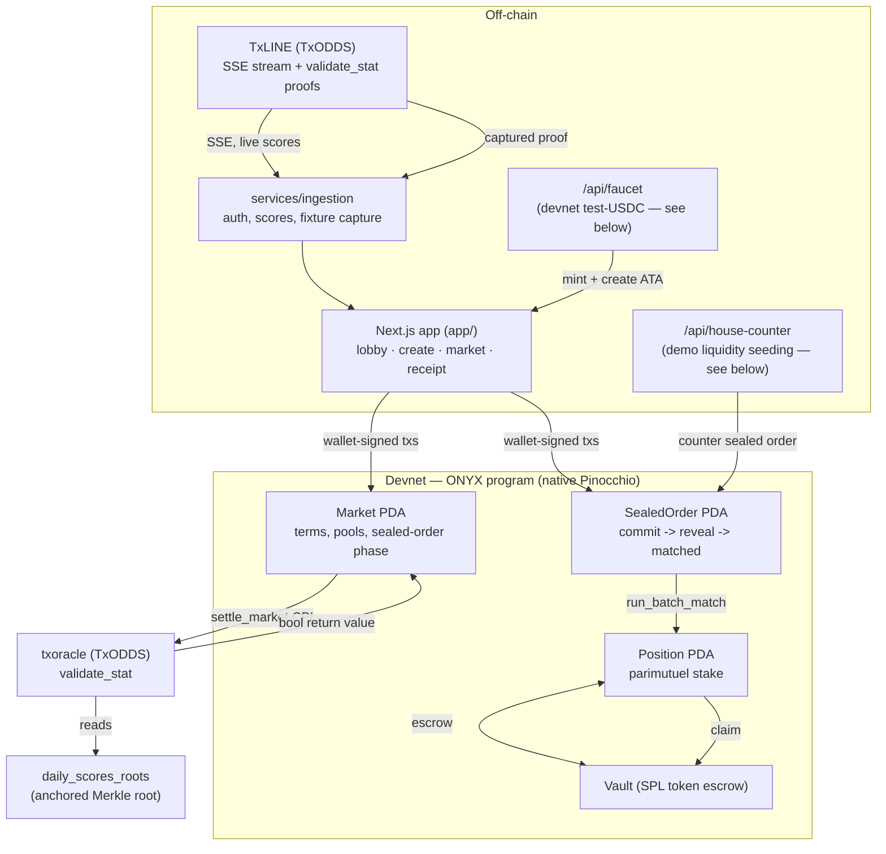

# ONYX

**Trustless sports settlement on Solana, built directly on TxODDS's TxLINE.**

Every market settles via a live CPI into TxLINE's own `validate_stat` program —
not an admin key, not an off-chain resolver. Every settlement produces a
receipt anyone can independently verify against public RPC. Bets can be
placed as **sealed orders** — hidden until a batch closes, then matched at a
single uniform price with no time-priority advantage, killing front-running
and copy-trading without adding any trust dependency.

Built for the [TxODDS World Cup Hackathon](https://superteam.fun/earn/listing/prediction-markets-and-settlement/)
— Prediction Markets & Settlement track. Native Pinocchio (`no_std`), no
Anchor. Devnet. This repository is the complete application: on-chain
program, Next.js frontend, and TxLINE data services.

| | |
|---|---|
| **Devnet program** | [`4LpMzq6wXYFMzxgbyMyN2ja4EQhPsYGHSCAvjwzA18MB`](https://explorer.solana.com/address/4LpMzq6wXYFMzxgbyMyN2ja4EQhPsYGHSCAvjwzA18MB?cluster=devnet) |
| **TxLINE oracle used** | `6pW64gN1s2uqjHkn1unFeEjAwJkPGHoppGvS715wyP2J` (txoracle, devnet) |
| **Run the app** | `cd app && bun install && bun run dev` |
| **Reproduce the full lifecycle in one command** | `bun run demo` (from the repo root) |

---

## The four-part story

**1. Trustless settlement.** `settle_market` CPIs directly into TxLINE's
`validate_stat` and reads back a boolean. No admin discretion, no off-chain
resolver — same proof in, same payout out, every time. [Real tx →](#the-sealed-order-lifecycle-real-tx-signatures)

**2. An independently verifiable receipt.** Every settled market's outcome
is checkable by a stranger against public RPC alone: `validate_stat`'s own
return value, its on-chain log lines, and the `Market` account's
status/outcome all have to agree — with zero trust in ONYX's UI. See
`/receipt/:market` in the app.

**3. Parametric props, not just "who wins."** Markets are predicates over
TxLINE's per-fixture stat keys (`stat[key] {>,<,=} threshold`, optionally
combining two stats) — corners, cards, goals, whatever TxLINE tracks per
match — not just a binary final-score bet.

**4. MEV-proof sealed-bid privacy (Level 1).** Bets are submitted as a
32-byte commitment hash + locked collateral — side, size, and price are not
derivable from on-chain state until the bettor reveals. After the reveal
window, a single deterministic uniform-price batch match runs: no order
benefits from submission order, so front-running and copy-trading have
nothing to react to. [Real tx →](#the-sealed-order-lifecycle-real-tx-signatures)

---

## Architecture



**Lifecycle:** `open_market_sealed` → `submit_sealed_order` (Commit — only a
hash is on-chain) → `reveal_order` (Reveal) → `run_batch_match` (uniform
clearing price, permissionless) → matched volume becomes an ordinary
parimutuel `Position` → `settle_market` (real oracle CPI, unmodified by any
of the above) → `claim`.

---

## Verifiable proof — real devnet transactions

Every signature below is real, on public devnet RPC, from this exact build.
Open any of them on the [Solana Explorer](https://explorer.solana.com)
(`?cluster=devnet`) or `solana confirm -v <sig> --url https://api.devnet.solana.com`
— nothing here needs ONYX's own UI to be trusted.

### The sealed-order lifecycle (real tx signatures)

From one full run of `bun run demo` (market
[`2VGU78vkkcYbHkdsZiowVi9R4KatY8BB1zVD32kHdHG4`](https://explorer.solana.com/address/2VGU78vkkcYbHkdsZiowVi9R4KatY8BB1zVD32kHdHG4?cluster=devnet)):

| Stage | Tx | What to check |
|---|---|---|
| **Sealed commit** | [`52VkeMw5eiV3...`](https://explorer.solana.com/tx/52VkeMw5eiV3xnnAPWkmSkUsLEAUa5Av7aKi94nRi7PxRWfQFQnk8n2UVcGo367phbD3Caz7Q5fnPqL9SKvsP2vn?cluster=devnet) | Fetch the resulting `SealedOrder` account — bytes 121 (side) and 128-135 (size) read back as zero. Only a 32-byte commitment hash + the locked collateral amount are on-chain. |
| **Batch match** | [`JMUsrZCwhQh9Tsw...`](https://explorer.solana.com/tx/JMUsrZCwhQh9TswLTqV5e8knabZmgB6G2pKa23DYVQBZdtrBgZDgMVAzKVSWRLn6S31FGJUNdE6P6CyrwXrHHGJ?cluster=devnet) | `Market.phase` flips to `Matched` (3), `clearing_price` is set. Deterministic and order-independent by construction — see `matching::tests::order_independence` in [`programs/onyx/src/matching.rs`](programs/onyx/src/matching.rs) for a bit-exact proof (same orders, three input orderings, identical result). |
| **Settlement (real oracle CPI)** | [`5tLRuV7XPCsRsGddA9...`](https://explorer.solana.com/tx/5tLRuV7XPCsRsGddA962y6Mpws1pRSeBqMH9hBBs7notEZCxUSkeWFEo1Cd9i1nb84sVms5p8ZQ7dgBdTsxXi6rF?cluster=devnet) | Program logs show the CPI into `6pW64gN1s2uqjHkn1unFeEjAwJkPGHoppGvS715wyP2J`'s `validate_stat`, its `Evaluate predicate to: true` log line, and the boolean return value. `Market.outcome` is set from that return value, nothing else. |
| **Claim** | [`2XZr6xuPH4L15SXZ...`](https://explorer.solana.com/tx/2XZr6xuPH4L15SXZcHbL27qJ2BgMNfA7eGkTrf7MeMv76imq3jSULTaeyAxg5PhU7Svdsaky4Rbj8mwxT4xtTxDm?cluster=devnet) | Payout = stake + stake/winning_pool × losing_pool − 1% fee, computed on-chain. In this run: 1,000,000 stake → 1,990,000 payout — matches the formula exactly. |

An earlier, independent run against the **original L0 (non-sealed) path**
also settled live:
[`5a4scCzjPPgVovtpz9mEfpLBXS1XCWMA6ZGdpZAmLjQZyd9PRCAjbqosNpRywkT4MAejQu5EyTqNe2fUeSBte6s4`](https://explorer.solana.com/tx/5a4scCzjPPgVovtpz9mEfpLBXS1XCWMA6ZGdpZAmLjQZyd9PRCAjbqosNpRywkT4MAejQu5EyTqNe2fUeSBte6s4?cluster=devnet).

### Reproduce this yourself

```bash
bun run demo   # from the repo root
```

This is the deterministic replay/fallback harness: it starts the app,
creates a fresh sealed market on the one fixture with a bundled real
captured TxLINE proof, places a sealed bet, seeds a counter-order, reveals
both sides, runs the batch match, settles via the real oracle CPI, and
claims the payout — printing every signature above (freshly generated, on
throwaway accounts, safe to re-run any number of times). If a live demo
ever flakes during judging, this one command re-proves the entire journey
against real devnet from scratch.

---

## Being straight about what's real (no bluff)

This project's whole thesis is "verify, don't trust" — so here's exactly
where that does and doesn't extend, including the parts that took
iteration to get right:

- **Demo liquidity is seeded, not organic.** A solo bettor's sealed order
  needs a counterparty for the batch match to produce a fill. In this
  build, [`app/src/app/api/house-counter/route.ts`](app/src/app/api/house-counter/route.ts)
  — a server-only Next.js route, never shipped to the browser — submits a
  deterministic opposite-side sealed order from the same devnet wallet that
  already acts as this build's test-USDC mint authority, so a judge running
  the demo alone still sees a real match. **This is explicitly a demo
  convenience, clearly labeled in the code, not a production matching
  engine or organic liquidity.** It doesn't change any on-chain trust
  boundary — the house submits a normal, publicly-visible transaction like
  any other bettor, and the program cannot distinguish it from anyone
  else's order. A production deployment needs real two-sided order flow, or
  a proper liquidity pool with its own risk model — neither is built here.
- **New wallets get test-USDC from a devnet faucet, not organically.** A
  fresh wallet has no ATA and no balance for the test-USDC mint, and
  `submit_sealed_order` does a raw SPL transfer with no ATA-creation
  fallback — so a brand new wallet's first bet would otherwise fail outright.
  [`app/src/app/api/faucet/route.ts`](app/src/app/api/faucet/route.ts)
  — server-only, same pattern as the house-counter route above — creates the
  connecting wallet's ATA if missing and mints it test-USDC (via the same
  devnet mint authority) before a bet is placed. **This only works because
  this build controls the test-USDC mint's authority; a real deployment
  swapping in actual USDC would have no such faucet and users would arrive
  with their own funded ATA already, same as any other SPL token.**
- **Devnet test-USDC, not real USDC.** The escrow mint is a devnet SPL
  token created by this build (6 decimals, same interface as USDC) — real
  USDC doesn't exist to move on devnet. `open_market`/`open_market_sealed`
  only check that the mint matches `Config.usdc_mint`; swapping in a real
  USDC mint address on mainnet requires no program changes.
  "Devnet or mainnet, either is allowed" per the track's own guidance.
- **The client-side Merkle leaf re-derivation is labeled experimental.**
  Settlement trust never depended on it — it comes from `validate_stat`'s
  own on-chain return value and log lines, checkable by anyone. An
  independent attempt to re-derive TxLINE's stat-leaf hash client-side (for
  an extra, purely illustrative verification layer) didn't match the
  on-chain root after ~15 encoding variants tried; the exact byte layout is
  an open question logged in [`OPEN_QUESTIONS.md`](OPEN_QUESTIONS.md)
  (O2) rather than silently faked or hidden. The receipt page badges this
  section "experimental — independent of the settlement verdict above" so
  it can't be misread as a failed settlement.
- **MagicBlock Ephemeral Rollup / TEE work is real but held back from the
  submission.** Delegate → execute-on-ER → commit-to-L1 and a live,
  DCAP-verified TEE attestation were both proven end-to-end on devnet
  ([`BUILD_STATE.md`](BUILD_STATE.md)) as a deliberate de-risk spike — then
  explicitly *not* built into the product. This track isn't judged on it,
  and moving any part of matching into a TEE reintroduces a
  hardware/operator trust dependency that this project's core pitch argues
  against. Kept as roadmap/interview material, not shipped code.
  Confidential-USDC via MagicBlock's Private Payments product was
  separately evaluated and rejected outright —
  [`PRIVATE_PAYMENTS_CUSTODY_ANALYSIS.md`](PRIVATE_PAYMENTS_CUSTODY_ANALYSIS.md)
  has the full reasoning (it would move fund-routing decisions outside
  on-chain verifiability).
- **This is a hackathon build, not a compliance-reviewed money-services
  product.** No real funds, no jurisdiction/KYC handling. Framed as
  verifiable settlement infrastructure, not a live betting product.

---

## Setup & run (bun)

Requires [bun](https://bun.sh) `>=1.3.0`, and a devnet Solana CLI wallet at
`~/.config/solana/id.json` (or point `ANCHOR_WALLET` at one) funded with
devnet SOL (`solana airdrop 2 --url devnet`).

```bash
git clone <this repo> && cd Onyx
bun install

# One-time: bootstrap the on-chain Config + test-USDC mint + the original
# L0-proven market (idempotent, safe to re-run).
bun run services/ingestion/src/l0_loop_test.ts

# Run the app
cd app
cp .env.example .env.local   # or set NEXT_PUBLIC_SOLANA_RPC_URL / ONYX_PROGRAM_ID yourself
bun run dev                  # http://localhost:3000
```

To rebuild and redeploy the on-chain program yourself:

```bash
cd programs/onyx
cargo build-sbf
cargo test                                      # 25 host tests, incl. a real
                                                 # mollusk-svm SBF execution of
                                                 # refund_expired with a
                                                 # simulated Clock
solana program deploy target/deploy/onyx.so \
  --program-id 4LpMzq6wXYFMzxgbyMyN2ja4EQhPsYGHSCAvjwzA18MB \
  --url https://api.devnet.solana.com
```

Other useful scripts (all under [`services/ingestion/src/`](services/ingestion/src/),
run with `bun run services/ingestion/src/<file>.ts` from the repo root):
`sealed_order_test.ts` (sealed-order lifecycle only, CLI), `er_delegate_test.ts`
and `per_spike_test.ts` (the MagicBlock de-risk spikes, not part of the
product).

---

## Repo layout

```
programs/onyx/           on-chain program (Pinocchio, no_std, native)
app/                     Next.js frontend — lobby, create, market, receipt
  src/lib/instructions.ts    single source of truth for every instruction's
                             byte encoding (shared by the wallet-signed UI
                             and the verification script)
  src/app/api/house-counter/ demo liquidity seeding — see "no bluff" above
  src/app/api/faucet/        devnet test-USDC faucet — see "no bluff" above
  scripts/verify-flow.ts     the reproducible full-lifecycle proof
services/ingestion/      TxLINE auth/data client + devnet test harnesses
scripts/run-demo.sh      one-command demo (`bun run demo`)
BUILD_STATE.md           full build/proof log, chronological
OPEN_QUESTIONS.md        everything still open, and why it doesn't block
PRIVATE_PAYMENTS_CUSTODY_ANALYSIS.md   why confidential-USDC was rejected
```

The byte-level program spec ("ONYX — Implementation & Interface
Specification") lives in the working notes outside this repo — available on
request; [`BUILD_STATE.md`](BUILD_STATE.md) records every implemented
instruction and its discriminator in the meantime.

---

## Submission checklist (self-assessed against the track's stated rules)

> "Teams must submit a functional build or live testnet application
> utilizing TxLINE data as a primary input to qualify for prizes."
> — TxODDS World Cup Hackathon announcement

| Requirement | Status |
|---|---|
| Functional build / live testnet application | ✅ Deployed devnet program `4LpMzq6...`, live app, real tx signatures above |
| TxLINE data as a primary input | ✅ Live SSE stream drives the lobby/market views; a real captured `validate_stat` proof drives settlement — both surfaces, not just one |
| Devnet acceptable | ✅ Per the track's own guidance ("devnet is safer/faster for a hackathon... either is allowed") |
| README + repo | ✅ This file; **repo is on GitHub but currently private — make it public (or grant judge access) before submitting** |
| Demo video (≤5 min, "evaluated heavily") | ⬜ Not recorded — yours to do; `bun run demo` gives a scriptable, reproducible take that can't flake mid-recording |
| API-feedback answer | ⬜ Mentioned as a day-11 deliverable in the original planning notes — not written this session; confirm whether the current Superteam Earn submission form still asks for it |
| Settlement currency requirement | No explicit USDC/USDT requirement found in the track rules I could check — ONYX uses a devnet SPL token standing in for USDC (see "no bluff" section) |

I checked the live Superteam Earn listing and the TxODDS announcement post
directly for this table; the listing page itself doesn't expose full
submission-form details (likely rendered client-side), so double-check the
actual submission form on Superteam Earn for anything beyond the two items
flagged above before the July 19, 2026 23:59 UTC deadline.
