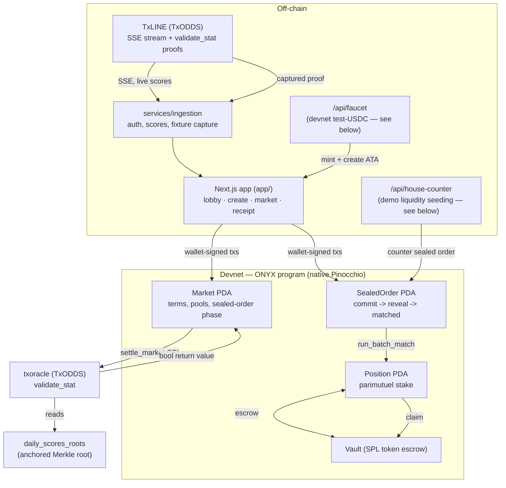

# ONYX

**Trustless sports settlement on Solana, built directly on TxODDS's TxLINE.**

Every market settles via a live CPI into TxLINE's own `validate_stat` program —
not an admin key, not an off-chain resolver. Every settlement produces a
receipt anyone can independently verify against public RPC. Bets can be
placed as **sealed orders** — hidden until a batch closes, then matched at a
single uniform price with no time-priority advantage, killing front-running
and copy-trading without adding any trust dependency.

Built for the [TxODDS World Cup Hackathon](https://superteam.fun/earn/listing/prediction-markets-and-settlement/)
— Prediction Markets & Settlement track. Native Pinocchio (`no_std`), no
Anchor. Devnet. This repository is the complete application: on-chain
program, Next.js frontend, and TxLINE data services.

| | |
|---|---|
| **Devnet program** | [`4LpMzq6wXYFMzxgbyMyN2ja4EQhPsYGHSCAvjwzA18MB`](https://explorer.solana.com/address/4LpMzq6wXYFMzxgbyMyN2ja4EQhPsYGHSCAvjwzA18MB?cluster=devnet) |
| **TxLINE oracle used** | `6pW64gN1s2uqjHkn1unFeEjAwJkPGHoppGvS715wyP2J` (txoracle, devnet) |
| **Run the app** | `cd app && bun install && bun run dev` |
| **Reproduce the full lifecycle in one command** | `bun run demo` (from the repo root) |

---

## The five-part story

**1. Trustless settlement.** `settle_market` CPIs directly into TxLINE's
`validate_stat` and reads back a boolean. No admin discretion, no off-chain
resolver — same proof in, same payout out, every time. [Real tx →](#the-sealed-order-lifecycle-real-tx-signatures)

**2. An independently verifiable receipt.** Every settled market's outcome
is checkable by a stranger against public RPC alone: `validate_stat`'s own
return value, its on-chain log lines, and the `Market` account's
status/outcome all have to agree — with zero trust in ONYX's UI. See
`/receipt/:market` in the app.

**3. Parametric props, not just "who wins."** Markets are predicates over
TxLINE's per-fixture stat keys (`stat[key] {>,<,=} threshold`, optionally
combining two stats) — corners, cards, goals, whatever TxLINE tracks per
match — not just a binary final-score bet.

**4. MEV-proof sealed-bid privacy (Level 1).** Bets are submitted as a
32-byte commitment hash + locked collateral — side, size, and price are not
derivable from on-chain state until the bettor reveals. After the reveal
window, a single deterministic uniform-price batch match runs: no order
benefits from submission order, so front-running and copy-trading have
nothing to react to. [Real tx →](#the-sealed-order-lifecycle-real-tx-signatures)

**5. Sub-second execution on a MagicBlock Ephemeral Rollup, same MEV-proof
guarantee.** This is the app's **default trading flow** (`ErTradingPanel`,
the lead panel on every market page) — not a side demo. A market and each
trader's `TradingAccount` delegate to an Ephemeral Rollup; bet, resize, and
cancel all confirm sub-second there, still as a sealed commitment matched
in short deterministic batches (3s cadence), not instant execution against
fabricated counterparty liquidity. Once a batch clears, state undelegates
back to base for settlement and withdrawal — the same `settle_market` /
oracle CPI in Part 1, untouched. Every read and write is routed to
whichever ledger (base or the resolved ER endpoint) currently holds that
account's authoritative state — see [`src/lib/erRouting.ts`](app/src/lib/erRouting.ts)
— and a wrong-ledger race (e.g. a transaction landing right as an account
un/delegates) is caught and surfaced as a plain-language retry message, not
a raw RPC error. [Real tx →](#the-er-fast-lifecycle-real-tx-signatures)

---

## Architecture



**Lifecycle (classic sealed-order flow, always base-only, still fully
available — collapsed by default behind "show classic sealed-order flow" on
the market page):** `open_market_sealed` → `submit_sealed_order` (Commit —
only a hash is on-chain) → `reveal_order` (Reveal) → `run_batch_match`
(uniform clearing price, permissionless) → matched volume becomes an
ordinary parimutuel `Position` → `settle_market` (real oracle CPI,
unmodified by any of the above) → `claim`.

### The ER-fast flow (default trading experience)

```mermaid
flowchart TB
    subgraph offchain2["Off-chain"]
        App2["Next.js app — ErTradingPanel\n(the default trade panel on every market)"]
        Router["MagicBlock router\ngetDelegationStatus"]
        HouseFast["/api/house-counter-fast\n(demo liquidity, same disclosure as above)"]
    end

    subgraph base2["Devnet base layer"]
        MarketB["Market PDA"]
        TradingB["TradingAccount PDA\n(one per user per market)"]
        VaultB["Vault (SPL token escrow)"]
    end

    subgraph er2["Ephemeral Rollup (MagicBlock, delegated)"]
        MarketER["Market (delegated copy)"]
        TradingER["TradingAccount (delegated copy)"]
    end

    TxOracle2["txoracle (TxODDS)\nvalidate_stat — same program as the classic flow"]

    App2 -->|ask which ledger holds this account| Router
    App2 -->|delegate_market, open+deposit+delegate_trading_account\n(base, real SPL transfer in)| MarketB
    App2 -->|deposit| TradingB
    MarketB -.->|delegate| MarketER
    TradingB -.->|delegate| TradingER
    App2 -->|submit/reveal/cancel/run_batch_match_fast\n(routed to whichever ledger is authoritative)| TradingER
    HouseFast -->|counter TradingAccount| TradingER
    TradingER -.->|undelegate, market + every TradingAccount\nin ONE call| TradingB
    MarketER -.->|undelegate| MarketB
    MarketB -->|settle_market CPI\n(same oracle path as the classic flow)| TxOracle2
    App2 -->|withdraw_trading, base only| VaultB
```

**Lifecycle (ER-fast flow, the default on every market page):**
`delegate_market` (base, permissionless) → `open_trading_account` +
`deposit_trading` + `delegate_trading_account` (base, one combined
signature — the one real SPL transfer in) → `submit_order_fast` (Commit,
ER) → `reveal_order_fast` (Reveal, ER) → `run_batch_match_fast` (uniform
clearing price, ER, short deterministic batches — same MEV-proof
commit-reveal-batch shape as the classic flow, just executing on the
rollup) → `undelegate_trading_account` (market + every `TradingAccount` in
one call, back to base) → `settle_market` (same real oracle CPI, base) →
`withdraw_trading` (base). `cancel_order_fast` works at any point after
commit, including after an undelegate races ahead of it, as a safety net.

---

## Verifiable proof — real devnet transactions

Every signature below is real, on public devnet RPC, from this exact build.
Open any of them on the [Solana Explorer](https://explorer.solana.com)
(`?cluster=devnet`) or `solana confirm -v <sig> --url https://api.devnet.solana.com`
— nothing here needs ONYX's own UI to be trusted.

### The sealed-order lifecycle (real tx signatures)

From one full run of `bun run demo` (market
[`2VGU78vkkcYbHkdsZiowVi9R4KatY8BB1zVD32kHdHG4`](https://explorer.solana.com/address/2VGU78vkkcYbHkdsZiowVi9R4KatY8BB1zVD32kHdHG4?cluster=devnet)):

| Stage | Tx | What to check |
|---|---|---|
| **Sealed commit** | [`52VkeMw5eiV3...`](https://explorer.solana.com/tx/52VkeMw5eiV3xnnAPWkmSkUsLEAUa5Av7aKi94nRi7PxRWfQFQnk8n2UVcGo367phbD3Caz7Q5fnPqL9SKvsP2vn?cluster=devnet) | Fetch the resulting `SealedOrder` account — bytes 121 (side) and 128-135 (size) read back as zero. Only a 32-byte commitment hash + the locked collateral amount are on-chain. |
| **Batch match** | [`JMUsrZCwhQh9Tsw...`](https://explorer.solana.com/tx/JMUsrZCwhQh9TswLTqV5e8knabZmgB6G2pKa23DYVQBZdtrBgZDgMVAzKVSWRLn6S31FGJUNdE6P6CyrwXrHHGJ?cluster=devnet) | `Market.phase` flips to `Matched` (3), `clearing_price` is set. Deterministic and order-independent by construction — see `matching::tests::order_independence` in [`programs/onyx/src/matching.rs`](programs/onyx/src/matching.rs) for a bit-exact proof (same orders, three input orderings, identical result). |
| **Settlement (real oracle CPI)** | [`5tLRuV7XPCsRsGddA9...`](https://explorer.solana.com/tx/5tLRuV7XPCsRsGddA962y6Mpws1pRSeBqMH9hBBs7notEZCxUSkeWFEo1Cd9i1nb84sVms5p8ZQ7dgBdTsxXi6rF?cluster=devnet) | Program logs show the CPI into `6pW64gN1s2uqjHkn1unFeEjAwJkPGHoppGvS715wyP2J`'s `validate_stat`, its `Evaluate predicate to: true` log line, and the boolean return value. `Market.outcome` is set from that return value, nothing else. |
| **Claim** | [`2XZr6xuPH4L15SXZ...`](https://explorer.solana.com/tx/2XZr6xuPH4L15SXZcHbL27qJ2BgMNfA7eGkTrf7MeMv76imq3jSULTaeyAxg5PhU7Svdsaky4Rbj8mwxT4xtTxDm?cluster=devnet) | Payout = stake + stake/winning_pool × losing_pool − 1% fee, computed on-chain. In this run: 1,000,000 stake → 1,990,000 payout — matches the formula exactly. |

An earlier, independent run against the **original L0 (non-sealed) path**
also settled live:
[`5a4scCzjPPgVovtpz9mEfpLBXS1XCWMA6ZGdpZAmLjQZyd9PRCAjbqosNpRywkT4MAejQu5EyTqNe2fUeSBte6s4`](https://explorer.solana.com/tx/5a4scCzjPPgVovtpz9mEfpLBXS1XCWMA6ZGdpZAmLjQZyd9PRCAjbqosNpRywkT4MAejQu5EyTqNe2fUeSBte6s4?cluster=devnet).

### Reproduce this yourself

```bash
bun run demo   # from the repo root
```

This is the deterministic replay/fallback harness: it starts the app,
creates a fresh sealed market on the one fixture with a bundled real
captured TxLINE proof, places a sealed bet, seeds a counter-order, reveals
both sides, runs the batch match, settles via the real oracle CPI, and
claims the payout — printing every signature above (freshly generated, on
throwaway accounts, safe to re-run any number of times). If a live demo
ever flakes during judging, this one command re-proves the entire journey
against real devnet from scratch.

### The ER-fast lifecycle (real tx signatures)

From one full run of `app/scripts/er_browser_proof.ts` (market
[`HUBmAk24oRg8rCT55XA5RSyXtW4Xz573qysbDtU83kuR`](https://explorer.solana.com/address/HUBmAk24oRg8rCT55XA5RSyXtW4Xz573qysbDtU83kuR?cluster=devnet),
real wallet-signed transactions from a real devnet keypair driving the
actual website — see that script's header comment for the exact honesty
framing). Every signature below was independently re-derived from
`getSignaturesForAddress` + decoded instruction discriminators directly
against devnet, cross-checked against both the market PDA and the
bettor's own `TradingAccount` PDA specifically — not copy-pasted from any
script's own printed output, which this exact run proved can mislabel a
step when a UI value hasn't refreshed within its polling window yet (a
real, separate gap this reconciliation exists to not repeat).

| Stage | Ledger | Tx | What to check |
|---|---|---|---|
| **Delegate market** | base | [`25Y5K99u...`](https://explorer.solana.com/tx/25Y5K99uizdvsWmpKYQ26tz6nN4Kng4r3CDcSMRn6eurStkiVsHd8JQDpU65dzbz6Br96QXwP4rFxtoMvaRFRy4S?cluster=devnet) | `Market`'s owner flips to the Delegation Program (`DELeGGvXpWV2fqJUhqcF5ZSYMS4JTLjteaAMARRSaeSh`) on base. |
| **Deposit + enable (one signature)** | base | [`4M5cBpBG...`](https://explorer.solana.com/tx/4M5cBpBGBxfj7m24UWqEG8tPCm8K6HW1WE5NHCikXQ6Y5usXd7YuNsLXzkF2TyVkMNGDirz72jpZnnUMomkKqyH9?cluster=devnet) | One tx, three instructions (`open_trading_account`+`deposit_trading`+`delegate_trading_account`): a real SPL transfer into the vault, then the new `TradingAccount` is immediately delegated too. |
| **Sealed commit (ER)** | **ER** | [`2R3Liugb...`](https://explorer.solana.com/tx/2R3LiugbLjPTwij7NDKGZEJ1vJkfeLmRUNjvnYBu5Uhh5aUS9GVvBiVKnYAfxvy8dBQwhXrTbqcXJq1xkvLp1LbR?cluster=devnet) | Confirms **Finalized** against the ER endpoint (`https://devnet-as.magicblock.app/`) and comes back **not found** against base — the account's authoritative state genuinely lives on the rollup right now, not simulated. Only the commitment hash + locked collateral are readable. |
| **Reveal (ER)** | **ER** | [`TLwJ2RGF...`](https://explorer.solana.com/tx/TLwJ2RGFC3jsrpFDa9wS2UNUAQqrqABoQ127eJ5zsdM86dQso3cbJu4oUMgpBc9LHnx1K1jxRiWhNEK6s3RdU9J?cluster=devnet) | Same Finalized-on-ER / not-found-on-base check; `TradingAccount.status` flips to `Revealed`. |
| **Batch match (ER)** | **ER** | [`2qQnKRn2...`](https://explorer.solana.com/tx/2qQnKRn24QLQLjAxtEDAZGPNTie6Wk8uHqzBTbWcyp4JNrojrg1BniRsjpo9GoPQMnTnfbsR146X4ZH2SzNbdnvP?cluster=devnet) | `Market.phase` flips to `Matched` on the ER; `TradingAccount.status` flips to `Matched` with `matched_size` set — same deterministic uniform-price algorithm as the classic flow (`matching::tests::order_independence`), just executing on the rollup. |
| **Undelegate (market + every TradingAccount, one call)** | ER→base | [`hbYdEt1X...`](https://explorer.solana.com/tx/hbYdEt1XoFSMwxwnjskNgD8YfCp4G9DCSYjqiSbvbT8LbW3Uvj86uyfhEbpoTV6aYSSMz5vAKHbSqw5wGH72cfy?cluster=devnet) | After this, `Market`'s owner is back to the ONYX program ID on base — the explicitly-requested multi-account undelegate probe, proven live (this call moved the market AND the bettor's `TradingAccount` together, not one CPI per account). |
| **Settlement (real oracle CPI)** | base | [`4frNeytM...`](https://explorer.solana.com/tx/4frNeytM3JtCzA1brd6McWDvFiWK1XBMp3K38szm7hjYkisQ7pHc6VELr4aMQqf9nDcWLigyxEezCtQYjwRy8MK8?cluster=devnet) | The exact same `settle_market` instruction as the classic flow — CPIs into TxLINE's real `validate_stat`, unaware this market ever touched an ER. |
| **Withdraw** | base | [`2JeypKSy...`](https://explorer.solana.com/tx/2JeypKSy5eifDb88emVT3X9qoEek8DHjqfQkxzniDtVncyUumahNnAtqdZ1kJiusVjhNcPHhXLQXZ4QifQzw9wVW?cluster=devnet) | Fetch the `TradingAccount` afterward: `claimed_winnings=true`, `available=0`. (Not quoting a wallet-balance delta here on purpose — this devnet wallet is reused across many test runs in this repo's history, so its raw balance history isn't a clean isolated signal; the account's own fields are the precise thing to check, and that's what settlement trust in this app has always meant — see the "independently verifiable receipt" part above.) |

Two more signatures worth knowing about, both real, both from the *house's*
side of this same market (the demo-liquidity counterparty — see "no bluff"
below), surfaced by the same reconciliation:
[`41TpnRBv...`](https://explorer.solana.com/tx/41TpnRBvY1yrwMym3jcTySKZusaCrbTsQnp5jsKn8UoLjpTyf3FxmbzpjgGX6zRsLtv2VbsycJh7E7sMH68Dscug?cluster=devnet)
(house's own deposit+enable) and
[`4sii6uJN...`](https://explorer.solana.com/tx/4sii6uJNdp8B94cBvirpzTC8TQEVM1rjbPYVpGxKLGuPAE5YeHTdpP9xDQt8CB3S1bzJfvwYrZjzqAVzp4mndGWn?cluster=devnet)
(house's reveal) — both triggered automatically by
`/api/house-counter-fast`, same disclosure as the classic flow's house
counterparty.

---

## Being straight about what's real (no bluff)

This project's whole thesis is "verify, don't trust" — so here's exactly
where that does and doesn't extend, including the parts that took
iteration to get right:

- **Demo liquidity is seeded, not organic.** A solo bettor's sealed order
  needs a counterparty for the batch match to produce a fill. In this
  build, [`app/src/app/api/house-counter/route.ts`](app/src/app/api/house-counter/route.ts)
  — a server-only Next.js route, never shipped to the browser — submits a
  deterministic opposite-side sealed order from the same devnet wallet that
  already acts as this build's test-USDC mint authority, so a judge running
  the demo alone still sees a real match. **This is explicitly a demo
  convenience, clearly labeled in the code, not a production matching
  engine or organic liquidity.** It doesn't change any on-chain trust
  boundary — the house submits a normal, publicly-visible transaction like
  any other bettor, and the program cannot distinguish it from anyone
  else's order. A production deployment needs real two-sided order flow, or
  a proper liquidity pool with its own risk model — neither is built here.
- **New wallets get test-USDC from a devnet faucet, not organically.** A
  fresh wallet has no ATA and no balance for the test-USDC mint, and
  `submit_sealed_order` does a raw SPL transfer with no ATA-creation
  fallback — so a brand new wallet's first bet would otherwise fail outright.
  [`app/src/app/api/faucet/route.ts`](app/src/app/api/faucet/route.ts)
  — server-only, same pattern as the house-counter route above — creates the
  connecting wallet's ATA if missing and mints it test-USDC (via the same
  devnet mint authority) before a bet is placed. **This only works because
  this build controls the test-USDC mint's authority; a real deployment
  swapping in actual USDC would have no such faucet and users would arrive
  with their own funded ATA already, same as any other SPL token.**
- **Devnet test-USDC, not real USDC.** The escrow mint is a devnet SPL
  token created by this build (6 decimals, same interface as USDC) — real
  USDC doesn't exist to move on devnet. `open_market`/`open_market_sealed`
  only check that the mint matches `Config.usdc_mint`; swapping in a real
  USDC mint address on mainnet requires no program changes.
  "Devnet or mainnet, either is allowed" per the track's own guidance.
- **The client-side Merkle leaf re-derivation is labeled experimental.**
  Settlement trust never depended on it — it comes from `validate_stat`'s
  own on-chain return value and log lines, checkable by anyone. An
  independent attempt to re-derive TxLINE's stat-leaf hash client-side (for
  an extra, purely illustrative verification layer) didn't match the
  on-chain root after ~15 encoding variants tried; the exact byte layout is
  an open question logged in [`OPEN_QUESTIONS.md`](OPEN_QUESTIONS.md)
  (O2) rather than silently faked or hidden. The receipt page badges this
  section "experimental — independent of the settlement verdict above" so
  it can't be misread as a failed settlement.
- **MagicBlock Ephemeral Rollup (ER) trading is shipped and is the default
  flow — an earlier draft of this README said otherwise; that was true of
  an early de-risk spike and is no longer true of this build.** Delegate →
  execute-on-ER → commit-to-L1 started as a deliberate de-risk spike
  ([`BUILD_STATE.md`](BUILD_STATE.md)) and was then built for real: a new
  `TradingAccount` type, 9 new program instructions, phase-based RPC
  routing in the frontend, and the `ErTradingPanel` UI that leads every
  market page. Nothing about ER changes the trust model in Part 1/2 above —
  it's a Solana-compatible rollup that commits back to L1 and is
  independently checkable, not an opaque execution environment, so
  delegating the *speed* layer to it doesn't ask anyone to trust new
  hardware or a new operator. See Part 5 above and the proof table below.
- **The separate MagicBlock TEE/PER track is real but still deliberately
  held back from the product — this part of the earlier claim stands.** A
  live, DCAP-verified TEE attestation was proven end-to-end on devnet
  ([`BUILD_STATE.md`](BUILD_STATE.md)) as its own de-risk spike, distinct
  from the ER work above. Moving any part of *matching* into a TEE
  reintroduces a hardware/operator trust dependency that this project's
  core pitch argues against, so it's kept as roadmap/interview material,
  not shipped code — unlike ER, this one hasn't changed.
  Confidential-USDC via MagicBlock's Private Payments product was
  separately evaluated and rejected outright —
  [`PRIVATE_PAYMENTS_CUSTODY_ANALYSIS.md`](PRIVATE_PAYMENTS_CUSTODY_ANALYSIS.md)
  has the full reasoning (it would move fund-routing decisions outside
  on-chain verifiability).
- **This is a hackathon build, not a compliance-reviewed money-services
  product.** No real funds, no jurisdiction/KYC handling. Framed as
  verifiable settlement infrastructure, not a live betting product.

---

## Setup & run (bun)

Requires [bun](https://bun.sh) `>=1.3.0`, and a devnet Solana CLI wallet at
`~/.config/solana/id.json` (or point `ANCHOR_WALLET` at one) funded with
devnet SOL (`solana airdrop 2 --url devnet`).

```bash
git clone <this repo> && cd Onyx
bun install

# One-time: bootstrap the on-chain Config + test-USDC mint + the original
# L0-proven market (idempotent, safe to re-run).
bun run services/ingestion/src/l0_loop_test.ts

# Run the app
cd app
cp .env.example .env.local   # or set NEXT_PUBLIC_SOLANA_RPC_URL / ONYX_PROGRAM_ID yourself
bun run dev                  # http://localhost:3000
```

To rebuild and redeploy the on-chain program yourself:

```bash
cd programs/onyx
cargo build-sbf
cargo test                                      # 44 host tests, incl. real
                                                 # mollusk-svm SBF execution
                                                 # (loads the actual compiled
                                                 # onyx.so) of refund_expired,
                                                 # withdraw_trading, and
                                                 # run_batch_match_fast --
                                                 # the fund-custody-critical
                                                 # and completeness-check
                                                 # logic, with a simulated
                                                 # Clock so no real waiting
solana program deploy target/deploy/onyx.so \
  --program-id 4LpMzq6wXYFMzxgbyMyN2ja4EQhPsYGHSCAvjwzA18MB \
  --url https://api.devnet.solana.com
```

Other useful scripts (all under [`services/ingestion/src/`](services/ingestion/src/),
run with `bun run services/ingestion/src/<file>.ts` from the repo root):
`sealed_order_test.ts` (classic sealed-order lifecycle only, CLI),
`er_trading_lifecycle_proof.ts` (the full ER-fast lifecycle — deposit →
delegate → submit/reveal/match on the ER → undelegate → settle → withdraw —
driven directly through `app/src/lib/instructions.ts`'s builders, no
browser), `er_omission_attack_test.ts` (proves the batch-inclusion
completeness check rejects both wrong-count omission and duplicate-account
padding), and `per_spike_test.ts` (the separate TEE/PER de-risk spike, not
part of the product — see the "no bluff" section above).

Browser-driven proofs with a real signing wallet (all under
[`app/scripts/`](app/scripts/), run with `bun run scripts/<file>.ts` from
inside `app/` while `bun run dev` is running): `er_browser_setup_market.ts
<commitSecs> <revealSecs>` creates a fresh sealed market with a configurable
window; `er_browser_proof.ts <marketPda>` drives the entire ER-fast
lifecycle above through the actual website — real transactions built by
the real `ErTradingPanel` code and signed by an injected wallet-adapter
provider backed by a real devnet keypair (see the script's header comment
for the exact honesty framing: it exercises the real production code path
via real button clicks, but it's not literally a human clicking Phantom).

---

## Repo layout

```
programs/onyx/           on-chain program (Pinocchio, no_std, native)
  src/state/trading_account.rs   ER-fast per-user-per-market account
  src/instructions/{open_trading_account,deposit_trading,delegate_trading_account,
    submit_order_fast,reveal_order_fast,cancel_order_fast,run_batch_match_fast,
    undelegate_trading_account,withdraw_trading}.rs   the 9 ER-fast instructions (disc 20-28)
app/                     Next.js frontend — lobby, create, market, receipt, portfolio
  src/lib/instructions.ts    single source of truth for every instruction's
                             byte encoding (shared by the wallet-signed UI
                             and the verification script)
  src/lib/erRouting.ts       phase-based RPC routing: resolves base vs. the
                             MagicBlock router's ER endpoint per account
  src/components/market/ErTradingPanel.tsx   the default trade panel (ER-fast)
  src/components/SealedOrderPanel.tsx        the classic flow, still available
  src/app/api/house-counter/      demo liquidity seeding — see "no bluff" above
  src/app/api/house-counter-fast/ same, for the ER-fast flow
  src/app/api/faucet/             devnet test-USDC faucet — see "no bluff" above
  scripts/verify-flow.ts     the reproducible classic-flow full-lifecycle proof
  scripts/er_browser_proof.ts     the reproducible ER-fast full-lifecycle proof
services/ingestion/      TxLINE auth/data client + devnet test harnesses
scripts/run-demo.sh      one-command demo (`bun run demo`)
BUILD_STATE.md           full build/proof log, chronological
OPEN_QUESTIONS.md        everything still open, and why it doesn't block
PRIVATE_PAYMENTS_CUSTODY_ANALYSIS.md   why confidential-USDC was rejected
```

The byte-level program spec ("ONYX — Implementation & Interface
Specification") lives in the working notes outside this repo — available on
request; [`BUILD_STATE.md`](BUILD_STATE.md) records every implemented
instruction and its discriminator in the meantime.

---

## Submission checklist (self-assessed against the track's stated rules)

> "Teams must submit a functional build or live testnet application
> utilizing TxLINE data as a primary input to qualify for prizes."
> — TxODDS World Cup Hackathon announcement

| Requirement | Status |
|---|---|
| Functional build / live testnet application | ✅ Deployed devnet program `4LpMzq6...`, live app, real tx signatures above — both the classic sealed-order flow and the default ER-fast flow |
| TxLINE data as a primary input | ✅ Live SSE stream drives the lobby/market views; a real captured `validate_stat` proof drives settlement — both surfaces, not just one |
| Devnet acceptable | ✅ Per the track's own guidance ("devnet is safer/faster for a hackathon... either is allowed") |
| README + repo | ✅ This file; **repo is on GitHub but currently private — make it public (or grant judge access) before submitting** |
| Demo video (≤5 min, "evaluated heavily") | ⬜ Not recorded — yours to do; lead with the ER-fast flow (the default trade panel) since that's the headline feature. `bun run demo` gives a scriptable, reproducible take of the classic flow that can't flake mid-recording; the ER-fast flow doesn't have an equivalent one-liner yet (`app/scripts/er_browser_proof.ts` proves it but needs Playwright + a running dev server, not camera-ready) — recording that path live, or investing in a matching one-command harness first, is still worth deciding before the deadline |
| API-feedback answer | ⬜ Mentioned as a day-11 deliverable in the original planning notes — not written this session; confirm whether the current Superteam Earn submission form still asks for it |
| Settlement currency requirement | No explicit USDC/USDT requirement found in the track rules I could check — ONYX uses a devnet SPL token standing in for USDC (see "no bluff" section) |

I checked the live Superteam Earn listing and the TxODDS announcement post
directly for this table; the listing page itself doesn't expose full
submission-form details (likely rendered client-side), so double-check the
actual submission form on Superteam Earn for anything beyond the two items
flagged above before the July 19, 2026 23:59 UTC deadline.
